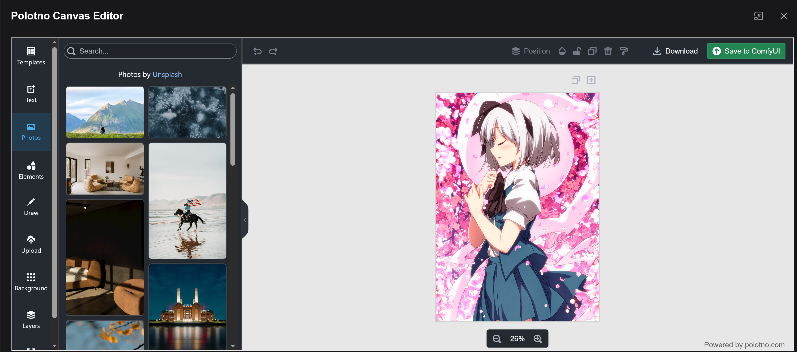

# ComfyUI-PolotnoCanvasEditor

**[中文](README_CN.md) | English**

A ComfyUI extension that integrates [Polotno](https://polotno.com) Canvas Editor for advanced image editing and design directly within ComfyUI.



## Features

- **Full Polotno Editor**: Access the complete Polotno canvas editor with all its features
- **Image Editing**: Load images from ComfyUI nodes and edit them with professional tools
- **Text & Elements**: Add text, shapes, and other design elements to your images
- **Templates**: Use Polotno's template system for quick designs
- **Save Back to ComfyUI**: Export edited images directly back to your ComfyUI workflow
- **Context Menu Integration**: Right-click on any image node to open in Polotno
- **Top Menu Button**: Quick access via the Polotno Canvas button in the top menu

## Installation

### From ComfyUI Manager

Search for "Polotno Canvas Editor" in the ComfyUI Manager and install.

### Manual Installation

1. Clone this repository into your `ComfyUI/custom_nodes` directory:
   ```bash
   cd ComfyUI/custom_nodes
   git clone https://github.com/jtydhr88/ComfyUI-PolotnoCanvasEditor.git
   ```

2. Restart ComfyUI

## Configuration

### API Key (Optional)

Polotno requires an API key for commercial use. For open-source and non-profit projects, you can use it with a random key (with Polotno branding visible).

To set your API key:
1. Go to **Settings** in ComfyUI
2. Navigate to **Polotno Canvas Editor**
3. Enter your API key in the **Polotno API Key** field

Get your API key from [https://polotno.com](https://polotno.com)

## Usage

### Opening the Editor

**Method 1: Top Menu Button**
- Click the "Polotno Canvas" button in the top menu to open a new canvas

**Method 2: Context Menu**
- Right-click on any image node (LoadImage, PreviewImage, SaveImage, etc.)
- Select "Open in Polotno Canvas Editor"
- The image will be loaded into the editor

### Editing

Once in the editor, you can:
- Add text, shapes, and other elements from the side panel
- Resize and transform elements
- Apply filters and effects
- Use layers for complex compositions

### Saving

Click the "Save to ComfyUI" button to:
- Export the current canvas as a PNG image
- Upload it to ComfyUI's input folder
- Update the source node with the new image (if opened from a node)

## Development

### Prerequisites

- Node.js 18+
- npm or pnpm

### Building

```bash
npm run install:all
npm run build:all
```

### Development Mode

```bash
npm run dev
```

This will watch for changes and rebuild automatically.

## Dependencies

- [Polotno](https://polotno.com) - Canvas editor library
- [Vue 3](https://vuejs.org) - UI framework
- [PrimeVue](https://primevue.org) - UI components
- [React](https://reactjs.org) - Required by Polotno

## License

MIT

## Credits

- [Polotno](https://polotno.com) for the amazing canvas editor
- [ComfyUI](https://github.com/comfyanonymous/ComfyUI) for the workflow platform
- [ComfyUI-AudioMass](https://github.com/jtydhr88/ComfyUI-AudioMass) for the plugin structure reference
